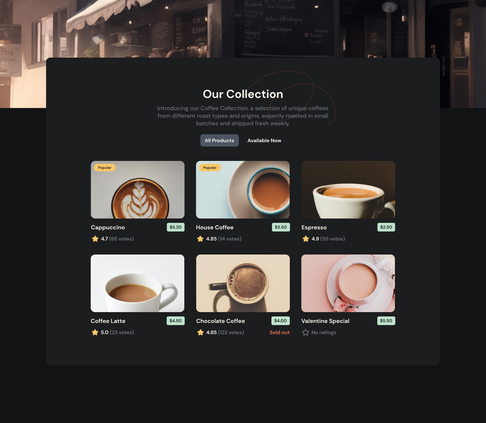

<h1 align="center">Coffee Catalog Filter | devChallenges</h1>

<div align="center">
   Solution for a challenge <a href="https://devchallenges.io/challenge/simple-coffee-listing" target="_blank">Simple Coffee Listing</a> from <a href="http://devchallenges.io" target="_blank">devChallenges.io</a>.
</div>

<div align="center">
  <h3>
    <a href="https://javed1301.github.io/Caffee-Listing-Page/">
      Demo
    </a>
    <span> | </span>
    <a href="https://github.com/Javed1301/Caffee-Listing-Page">
      Solution
    </a>
    <span> | </span>
    <a href="https://devchallenges.io/challenge/simple-coffee-listing">
      Challenge
    </a>
  </h3>
</div>

---

## Table of Contents

- [Overview](#overview)
  - [What I learned](#what-i-learned)
  - [Useful resources](#useful-resources)
- [Built with](#built-with)
- [Features](#features)
- [Contact](#contact)
- [Acknowledgements](#acknowledgements)

---

## Overview



This is a React-based product listing project where users can filter coffee items by availability. Clicking on filter buttons dynamically updates the product list with visual feedback using conditional styling.

### What I learned

This project helped reinforce many core React concepts and UI practices:

- 🧠 **React State Management**  
  Learned how to use `useState` for UI state, especially for toggling filters like `"allProduct"` vs `"available"`.

- 🔄 **Effect Hook (`useEffect`)**  
  Learned how to load data once and respond to changes in filters or data with dependency arrays.  
  Also fixed infinite re-render issues caused by missing dependency arrays.

- 🔍 **Filtering Logic**  
  Explored two strategies:
  - Using `useState` to store filtered results.
  - Computing filtered data directly inside `render` (more optimal for small datasets).

- 🎨 **Conditional Styling and Rendering**  
  - Changed button styles based on selected filter.
  - Rendered different SVGs or tags based on coffee rating/availability.
  - Used dynamic `className` expressions like:
    ```jsx
    className={productTag === "available" ? "tag-btn active" : "tag-btn"}
    ```

- 🧩 **Avoiding Anti-patterns**  
  - Avoided using plain `let` variables for filtered data (since React doesn’t track them).
  - Ensured all `.map()` loops use unique keys.

- 📦 **Component Design**  
  - Built reusable `<Card />` component.
  - Used `props` for data and rendered conditionally inside.

- 🧱 **Layout Focus: Grid**  
  Emphasized using **CSS Grid** to build responsive, clean layouts for the product cards.

### Useful resources

- [React Docs – useEffect](https://reactjs.org/docs/hooks-effect.html) – Helped understand dependency array behavior and infinite loop issues.
- [CSS Tricks – Grid Guide](https://css-tricks.com/snippets/css/complete-guide-grid/) – Great reference for implementing grid-based layout.
- [devChallenges Community](https://devchallenges.io/) – For motivation and good design prompts.

---

## Built with

- Semantic HTML5 markup
- CSS Grid Layout (emphasized)
- CSS Modules / Inline styles
- React (Functional Components)
- React Hooks (`useState`, `useEffect`)

---

## Features

- Filter products by availability using interactive buttons
- Dynamic styling of active filters
- Show product tags like “Popular” and “Sold Out” conditionally
- Grid-based responsive product layout
- SVG changes based on rating (0 vs >0)
- Minimal component-based architecture using React

---

## Acknowledgements

- DevChallenges.io for the challenge idea
- React documentation for solidifying concepts
- Stack Overflow and ChatGPT for debugging common pitfalls

---

## Author

- GitHub: [@your-username](https://github.com/your-username)
- Portfolio: [your-website.com](https://your-website.com)
